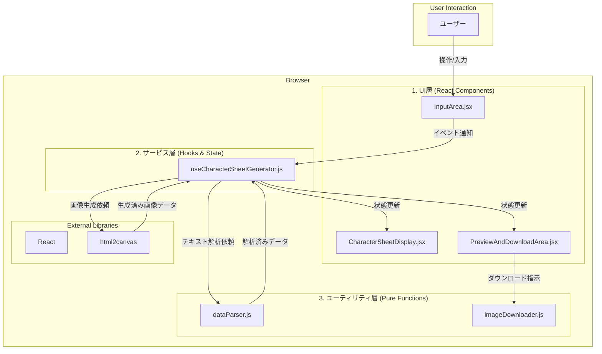

# プログラム設計書 - Charimage

## 1. 概要

本アプリケーションは、TRPG「クトゥルフ神話TRPG 第7版」のキャラクターシートテキストデータを読み込み、視覚的に整理された縦長の画像ファイルとして出力するシングルページアプリケーション（SPA）である。サーバーサイド処理は不要で、全ての処理はユーザーのブラウザ上で完結する。

- **目的**: オンラインセッションツール「ココフォリア」等で手軽に利用できるキャラクターシート画像を生成する。
- **対象ユーザー**: CoC7版のオンラインセッションプレイヤーおよびキーパー。
- **出力形式**: PNG画像。

## 2. 全体アーキテクチャ

アプリケーションは、関心の分離を目的とした「UI層」「サービス層」「ユーティリティ層」の3層アーキテクチャを採用する。これにより、コードの保守性、再利用性、テストの容易性を高める。



## 3. 技術スタック

- **フレームワーク**: React (Viteテンプレートを利用)
- **画像生成ライブラリ**: html2canvas
- **言語**: JavaScript (JSX), CSS, HTML

## 4. 各層の詳細設計

### 4.1. UI層 (React Components)

ユーザーインターフェースの描画とユーザー操作の受付を担当する。

- **`App.jsx`**:
  - アプリケーションのルートコンポーネント。
  - グローバルな状態（ローディング、エラー）を管理し、主要コンポーネントをレイアウトする。
  - カスタムフック `useCharacterSheetGenerator` を呼び出し、状態とロジックを集約する。

- **`InputArea.jsx`**:
  - キャラクターシートのテキストを貼り付ける `<textarea>` と、画像生成をトリガーする `<button>` を提供する。
  - ユーザーの入力と操作を親コンポーネント（`App.jsx`経由でフック）に通知する。

- **`CharacterSheetDisplay.jsx`**:
  - 解析済みのキャラクターデータオブジェクトをpropsとして受け取り、画像化対象となるHTMLをレンダリングする。
  - このコンポーネント自体が `html2canvas` のターゲットとなる。
  - 内部は `CharacterInfoSection`, `AttributesSection`, `SkillsSection` などのサブコンポーネントに分割される。

- **`PreviewAndDownloadArea.jsx`**:
  - 生成された画像のプレビュー (``) とダウンロードボタンを提供する。
  - 画像データURLをpropsとして受け取る。

- **`common/LoadingSpinner.jsx`, `common/ErrorMessage.jsx`**:
  - ローディング状態やエラー状態に応じて表示されるUIコンポーネント。

### 4.2. サービス層 (Service Layer)

アプリケーションのビジネスロジック、状態管理、外部ライブラリとの連携を担当する。

- **`hooks/useCharacterSheetGenerator.js` (カスタムフック)**:
  - アプリケーションの中心的なロジックと状態を管理する。
  - **管理する状態**:
    - `rawText`: 入力された生テキスト。
    - `parsedData`: 解析後のキャラクターデータオブジェクト。
    - `imageUrl`: 生成された画像のデータURL。
    - `isLoading`: ローディング状態。
    - `error`: エラーメッセージ。
  - **責務**:
    - `dataParser` を呼び出してテキストを解析する。
    - `html2canvas` を呼び出して `CharacterSheetDisplay` コンポーネントから画像を生成する。
    - UI層からのイベントをハンドリングし、状態を更新する。

### 4.3. ユーティリティ層 (Utility Layer)

特定の機能に特化した、再利用可能な純粋関数を提供する。

- **`utils/dataParser.js`**:
  - CoC7版キャラクターシートのテキストを解析し、構造化されたJavaScriptオブジェクトに変換する。
  - 正規表現と文字列操作を駆使する。フレームワーク非依存。
  - **入力**: テキスト文字列。
  - **出力**: キャラクターデータオブジェクト。解析失敗時はエラーをスローする。

- **`utils/imageDownloader.js`**:
  - 画像のデータURLとファイル名を引数に取り、ダウンロード処理を実行する。
  - 動的に `<a>` タグを生成し、クリックをシミュレートする。

## 5. データフロー

1.  **入力**: ユーザーが `InputArea` にテキストを貼り付け、「画像生成」ボタンをクリックする。
2.  **トリガー**: `useCharacterSheetGenerator` フック内の画像生成関数が呼び出される。
3.  **解析**: フックは `dataParser.js` を呼び出し、入力テキストを解析して `parsedData` 状態を更新する。
4.  **レンダリング**: `parsedData` の変更により `CharacterSheetDisplay` が再レンダリングされ、最新のキャラクター情報がDOMに反映される。
5.  **画像化**: フックは `useEffect` 等を利用して、更新された `CharacterSheetDisplay` のDOM要素を `html2canvas` に渡す。
6.  **プレビュー**: `html2canvas` が返した画像データURLを `imageUrl` 状態にセットする。これにより `PreviewAndDownloadArea` が更新され、プレビューが表示される。
7.  **ダウンロード**: ユーザーがダウンロードボタンをクリックすると、`imageDownloader.js` が `imageUrl` を使って画像を保存する。

## 6. 推奨ディレクトリ構造

```
my-coc7-charsheet-app/
└── src/
    ├── components/
    │   ├── sections/
    │   │   ├── AttributesSection.jsx
    │   │   ├── CharacterInfoSection.jsx
    │   │   ├── EquipmentSection.jsx
    │   │   └── SkillsSection.jsx
    │   ├── common/
    │   │   ├── ErrorMessage.jsx
    │   │   └── LoadingSpinner.jsx
    │   ├── CharacterSheetDisplay.jsx
    │   ├── InputArea.jsx
    │   └── PreviewAndDownloadArea.jsx
    ├── hooks/
    │   └── useCharacterSheetGenerator.js
    ├── utils/
    │   ├── dataParser.js
    │   └── imageDownloader.js
    ├── App.jsx
    ├── App.css
    ├── index.css
    └── main.jsx
```
